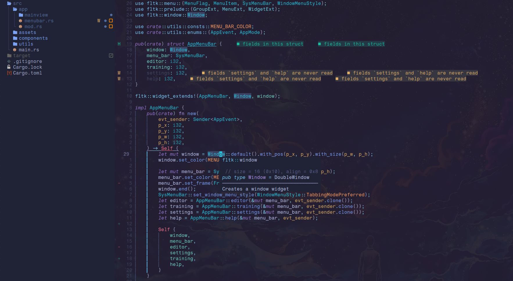

# My current neovim configuration

  

    
  

It's currenly based on [Lazy-nvim](https://github.com/folke/lazy.nvim)

## Plugins
- [Treesitter](https://github.com/nvim-treesitter/nvim-treesitter)
- [Telescope](https://github.com/nvim-telescope/telescope.nvim)
- [Lsp](https://github.com/neovim/nvim-lspconfig)
- [Neotree](https://github.com/nvim-neo-tree/neo-tree.nvim)
- [Nvim-cmp](https://github.com/hrsh7th/nvim-cmp)
- [Harpoon](https://github.com/ThePrimeagen/harpoon)
- [Copilot](https://github.com/github/copilot.vim)
- [Transparent](https://github.com/xiyaowong/transparent.nvim)
- [Autopairs](https://github.com/windwp/nvim-autopairs)

I've currently set it up to work with the following languages:
- Rust
- Python
- C/C++
- Lua (mainly for neovim configuration)

(The preinstalled colorscheme is [Tokyonight](https://github.com/folke/tokyonight.nvim))

